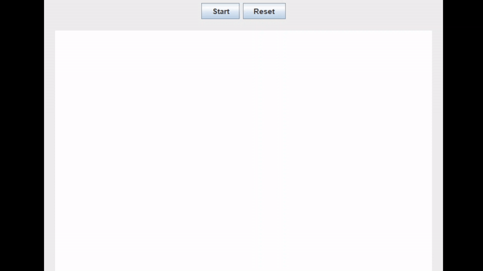
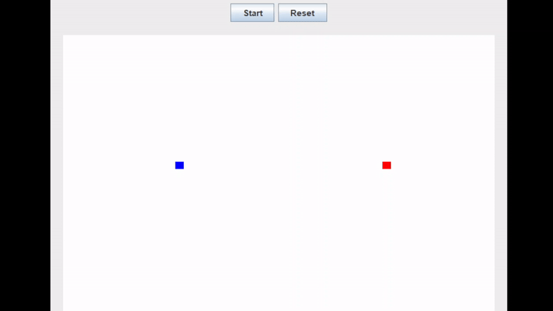
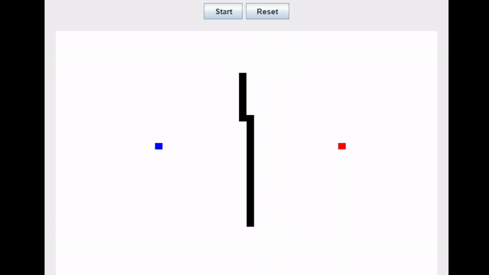

# Path Finder - Simulador de algoritmo de Dijkstra

Programa desenvolvido em Java, que implementa o algoritmo de Dijsktra e o simula em uma grade 50 x 50, e que utiliza o Swing para interface gráfica.

## Como utilizar

Após a instalação e execução do arquivo .jar, um JFrame contendo a matrix da simulação será aberto.

### 1. Com o botão esquerdo do mouse, selecione o ponto inicial e o final.

### 2. Com o botão direito do mouse, construa os obstáculos para a simulação.

### 3. Aperte start para começar a simulação

Para começar do início aperte o botão reset

## Observações

1. Caso não exista um caminho possível, o programa exibirá uma janela informa a impossibilidade de construir um caminho
2. São considerados apenas movimentos ortogonais, ou seja, movimentos na diagonal não são permitidos. Lembre-se disso quando construir os obstáculos

## Requisitos

### JRE 21
